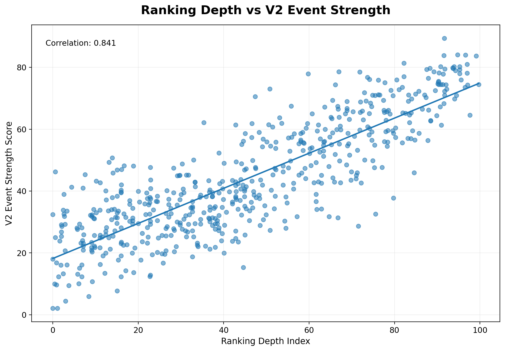
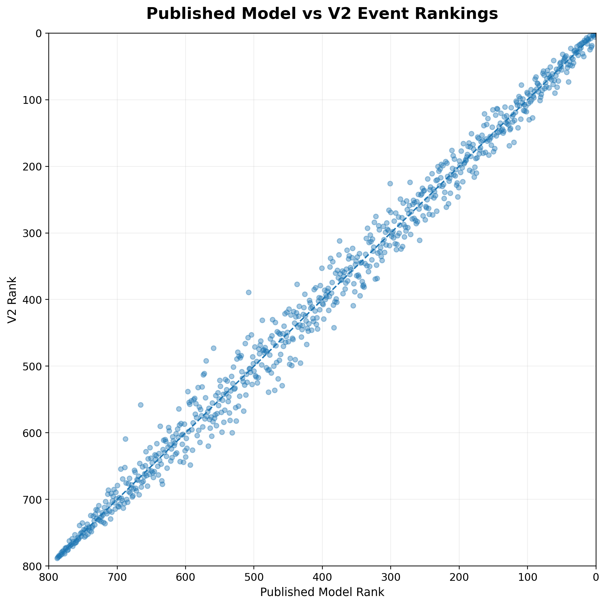
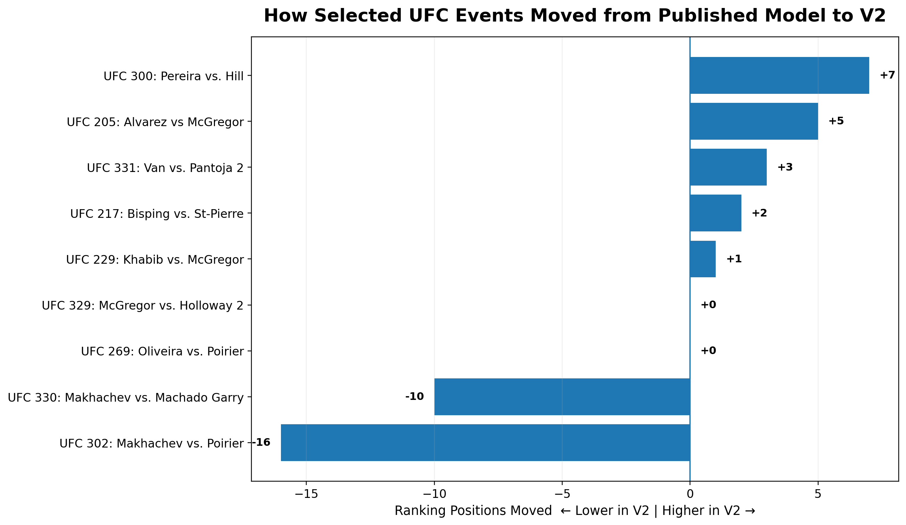
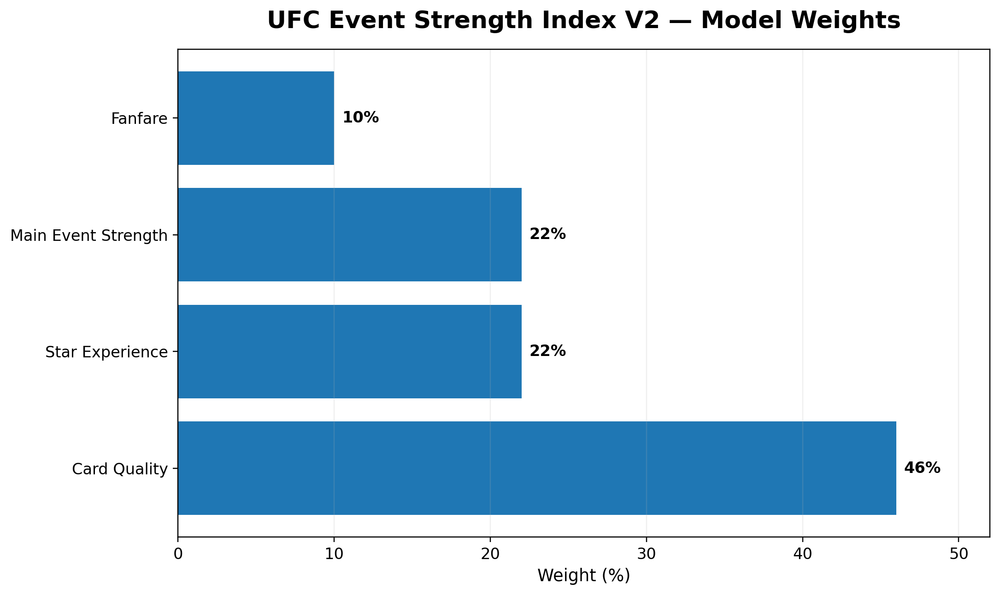
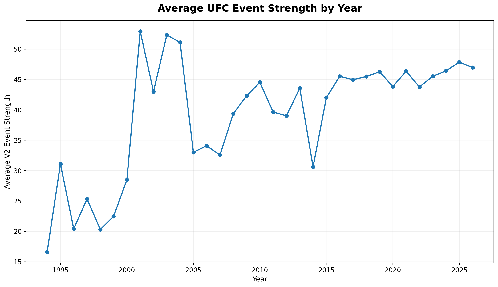

# UFC Event Strength Index V2

A data-driven model designed to quantify the strength of UFC events using information available **entering each event**.

V2 contains **788 UFC events from March 11, 1994 through September 19, 2026** and introduces a redesigned Card Quality component that gives substantially more importance to the depth of ranked talent across the entire card.

> **Status:** V2 is an improved model candidate and remains separate from the original published UFC Event Strength Index.

---

## Project Overview

The UFC Event Strength Index attempts to answer a simple question:

**How strong was a UFC card entering the event?**

Instead of judging a card based only on its main event or what happened afterward, the model evaluates the fighters and matchups that were scheduled at the time.

The project uses historical UFC data to measure factors including:

- Ranked fighters
- Ranked matchups
- Championship fights
- UFC experience
- UFC win percentage
- Win streaks
- Finishing ability
- Previous title-fight experience
- Previous UFC main-event experience
- Historical performance bonuses
- Main-event strength
- Event fanfare

All fighter-history statistics are calculated using **only information available before the event being scored**.

This prevents future information from leaking into historical event ratings.

---

## V2 Model

The overall V2 Event Strength score is composed of four components:

| Component | Weight |
|---|---:|
| Card Quality | 46% |
| Star Experience | 22% |
| Main Event Strength | 22% |
| Fanfare | 10% |

The final result is a **0–100 Event Strength score** used to compare UFC cards across eras.

---

## Major V2 Improvement: Ranking Depth

The largest change from the original model is the treatment of UFC rankings.

In V1, ranking strength was only one of six equally weighted Card Quality variables. This meant the depth of ranked fighters across a card had relatively little influence on the final event score.

V2 introduces a dedicated **Ranking Depth Index**.

### Ranking Depth Index

| Metric | Weight |
|---|---:|
| Total Ranking Points | 45% |
| Ranked Fighter Breadth | 25% |
| Ranked Matchups | 20% |
| Title Fights | 10% |

Ranking points reward higher-ranked fighters:

- Champion = 16 points
- #1 contender = 15
- #2 = 14
- ...
- #15 = 1
- Unranked = 0 when rankings are available

The Ranking Depth Index represents **30% of Card Quality**.

Because Card Quality represents 46% of the overall model, Ranking Depth has approximately **13.8% direct influence on the final Event Strength score** when ranking information is available.

---

## V2 Card Quality

The redesigned Card Quality component is:

| Metric | Weight within Card Quality |
|---|---:|
| Ranking Depth Index | 30% |
| Title Fights | 14% |
| UFC Experience | 14% |
| UFC Win Percentage | 14% |
| Win Streak | 14% |
| Finish Rate | 14% |

This makes the depth of ranked competition across the card substantially more meaningful while preserving the other measures of fighter and matchup quality.

---

## No Future Leakage

A core rule of the project is:

**Every statistic must represent what was known entering the fight or event.**

For example, a fighter's:

- UFC record
- win streak
- finishing rate
- previous title fights
- previous main events
- previous bonuses

are calculated using only UFC fights that occurred **before the event being evaluated**.

Current career totals are never applied retroactively to older events.

---

## Missing Data

Missing historical information is **not treated as zero**.

Some metrics did not exist or cannot be reliably reconstructed for the entire history of the UFC.

Examples include:

- Official UFC rankings before 2013
- Some historical fanfare information
- Certain early-event commercial metrics

When a component is unavailable, the model dynamically redistributes weight across the available components rather than assuming the missing value represents poor performance.

---

## Dataset

The current V2 dataset contains:

- **788 unique UFC events**
- Events from **March 11, 1994 – September 19, 2026**
- All UFC events in the working dataset through **UFC 331: Van vs. Pantoja 2**

Main dataset:

`UFC_EVENT_STRENGTH_V2_SANDBOX_2026-09-19.csv`

---

## Visualizations

### Top 15 UFC Events by V2 Event Strength

The highest-rated events in the current V2 model:

The V2 model currently rates **UFC 269: Oliveira vs. Poirier** as the strongest event in the dataset.

---

### Ranking Depth vs. Event Strength

V2 gives substantially more importance to the depth of ranked competition across an entire card.

This visualization shows the relationship between the new Ranking Depth Index and overall V2 Event Strength during the UFC rankings era.

---

### Published Model vs. V2

The redesign changes how individual events are evaluated while preserving much of the overall structure of the original model.

---

### Selected Event Rank Changes

Several events illustrate the effect of the redesigned Card Quality methodology particularly well.

Positive values indicate that an event ranks higher in V2, while negative values indicate that it ranks lower.

For example:

- **UFC 300** rises 7 positions.
- **UFC 205** rises 5 positions.
- **UFC 302** falls 16 positions.
- **UFC 330** falls 10 positions.

These changes are not manually imposed. They are outputs of the redesigned model.

---

### V2 Model Weights

The final V2 candidate places the greatest emphasis on Card Quality while maintaining separate measures of star experience, main-event strength, and fanfare.

---

### Event Strength Over Time

Annual averages provide a broader view of how measured UFC card strength has changed across the history of the promotion.

---

## Fanfare V2 Research

A separate whole-card Fanfare redesign was investigated during development.

The research explored:

- Whole-card fighter drawing history
- Card-position weighting
- Commercial demand
- Search-interest acceleration
- Whole-card star-power proxies

However, the experimental Fanfare model is **not included in the current V2 Event Strength scores**.

The existing Fanfare methodology is retained until a sufficiently reliable historical measure of absolute fighter popularity can be constructed.

This avoids forcing an experimental popularity proxy into the production model.

---

## Current Status

V2 is currently maintained as a separate model candidate from the original UFC Event Strength Index.

The original model remains unchanged.

Future work may include:

- Historical absolute fighter-popularity data
- Improved whole-card Fanfare
- Division/talent-pool depth analysis
- Additional model validation
- Automated event updates

---

## Author

**Adam Votto**

UFC analytics project focused on quantitative evaluation of event strength, fighter history, ranking depth, and card quality.
